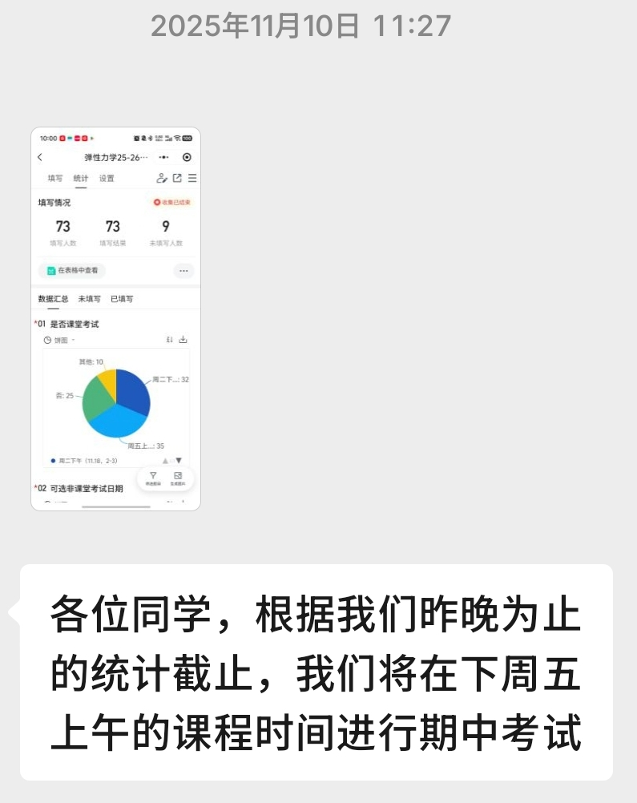
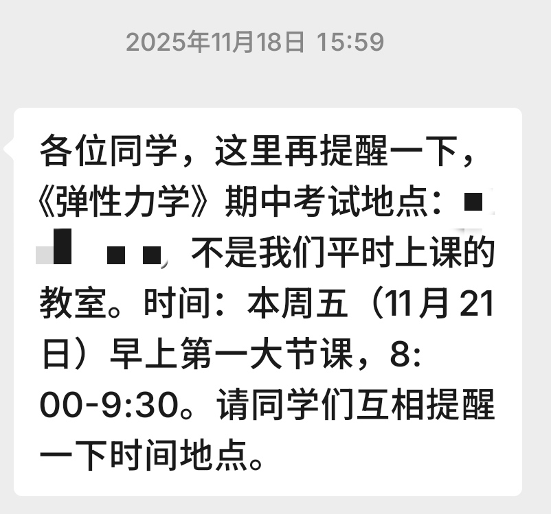
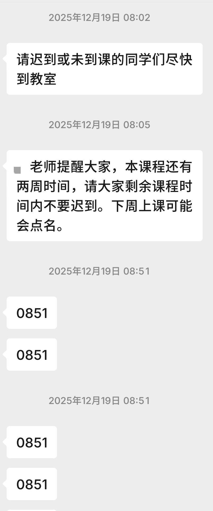
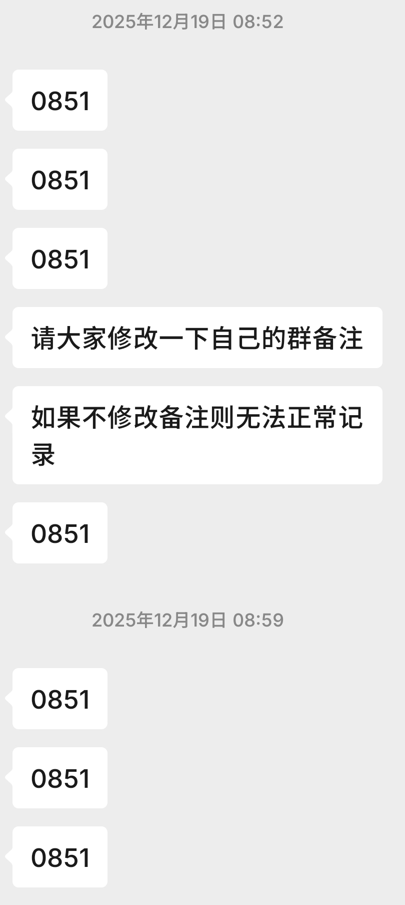
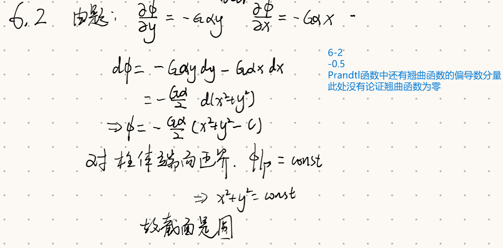
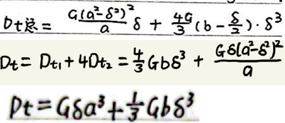
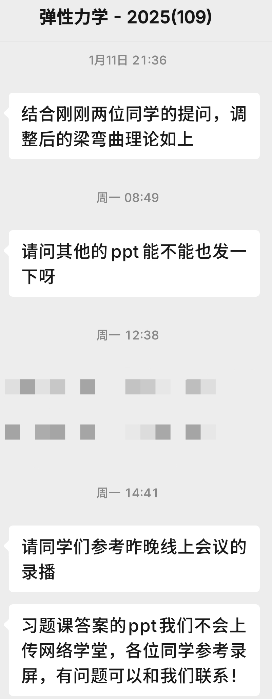

> 本项目中部分信息经过了模糊处理

本项目存放『2025年秋季』河北理工大学工程力学学院弹性力学的若干资料，包括本人手写的期中、期末知识点总结与回忆版期末试题。**本项目一切内容仅反映该学期课程状态。**

---

在使用这份资料前，首先请充分考虑自己是否选择上这门课。对于普招大类的同学，选课与否主要关乎是否获取『工程力学』学位。而对于特招大类的同学，此课程是与『材料力学』、两款『固体力学基础』并列的四选一项目。本人没有上过另外三门课，只知道材料力学的实验比较耗费心力，其中一款固体力学由某伟大先驱爱好者教授。因此这三门课程的详细信息只能依靠各位看官自行打听，本人在此只叙述自己上弹性力学的感受。各位看官不必因为以下的内容将弹力一票否决，因为其他课也可能藏着许多意外惊喜。选课实际上横竖都是赤。问题的关键在于你对哪门课抗性高，最适合自己的才是最好的。

---

上学期本人浏览院系水群，没有观测到弹力的多少负面消息`现在看来关于弹力的消息一共就没多少`。为了不做实验，便选了此课。课程一开始讲张量，就让本人大开眼界：符号体系混沌不便，讲授节奏速去速回，与[早前学过的另一门课](https://github.com/Rrmeazh/Elementary_Continuum_Mechanics)形成鲜明对比。此外，作业给分相较此前的专业课也是堪称杀手。满分10分每有一个小错扣0.5分。课程后期进度到平面问题时，甚至改出了大量7.5分、8分。本人在期中前体验尚好，不过这主要归功于之前学过连续介质力学，以及前期老师不考勤。毕竟催人入眠的授课还是弗如自学远矣。

然后，期中考试来了。这里就要说到那两份手写笔记是怎么诞生的了，不是因为本人学习刻苦认真，而是因为考试全闭卷，不抄几遍记不住。为了讲完微分提法期中已被拖到第10周。助教发起期中考试时间投票（周二下午vs周五早八vs其他），结果**早八**竟以微弱优势胜出。

> え？うそ？

> 再度鞭尸

在早八的沉重打击下本人毫无悬念地坠机了，低级失误不说多出三倍至少也是翻了四倍。更难绷的是助教在此基础上乘胜追击，又多扣了几分。若不是本人查卷恐怕这几分也会不明不白地失去`无能的丈夫：看着自己的期中分数被抵在早八受尽凌辱却无能为力`。

> 『题目有要求吗』

至此本门课程已经有了不做人的同学`以前没遇到过的全新属性，早八爱好者何意味`和拟人助教。但是这还没完，此时距离没有人类了还差一位老师，而这一环在第14周被补齐了。这门课在选课系统上的名义老师`以下称为MA老师`只在第一节课出现，此后直到第13周的课都是另一位年轻一些的老师`以下称为LI老师`教授。据MA老师自述是因为身体原因。LI老师虽然讲课质量感人，但是不会用考勤栓人。而MA老师虽然也是昏睡流讲课，但是架子就大多了`可能是因为彼时刚刚晋升内阁大学士吧`，刚上一次早八就启动了考勤。

> 零帧起手，不是哥们你讲得很好吗

> 逆天神秘仪式，~~感觉不如0947~~

从此以后每节课都定位签到😇

> 安卓端微信也是神了，虚拟定位被严防死守，根本用不了，鉴定为完败苹果

同时助教也没闲着，在杀手级扣分的基础上又叠加了错判乱判，本就不富余的平时分更加雪上加霜。

> 不知道在胡言乱语些什么，本人用的是全微分公式，和翘曲函数没有一点关系

> 这个更是重量级，本来图就画得不清楚，高阶小量就是因此出了一点差错。结果一看优秀作业直接气笑了。三个答案互不相同，最底下那个还是错的，结果放着这个不管来整治我了。

好歹混到了期末。期末考试前讲了一次习题课，效果只能说是如讲，承袭了张量时期的归去来兮风格。除了扫一遍公式，潦草地讲了习题之外便没有了。但是，即使是这么潦草的习题课，助教们也十分地珍视习题课PPT，具体表现就是『我偏不给你』。同学们只能速通潦草习题课的录屏。

> 就像守传家宝一样守着，只放出来一份梁弯曲理论的PPT，其他的PPT发出来又光速撤回。这个梁弯曲理论也是重量级。能量原理的作业题大部分都要用到，但是这本身是材料力学的知识，MA老师上课不讲，就等着同学们自学成才。直到期末周助教才把这个补丁打上。

期末考试自然也是闭卷。要背的东西相比期中堪称海量，难度更是超越期中。被弹力强入数日后，期末考试终于到来。拿到试卷后本人看到试卷，第一题赫然躺着20分的概念题，看得本人差点没脱口而出一句国粹。第四题也是给了本人一个大惊喜，经过一连串计算得到一串丑陋的答案。还好其他题较为正常。随着交卷之时到来，本人总算是解决了培养方案上的一处心腹大患。